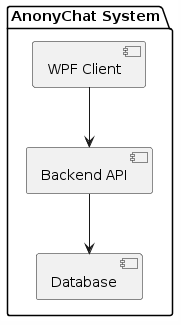
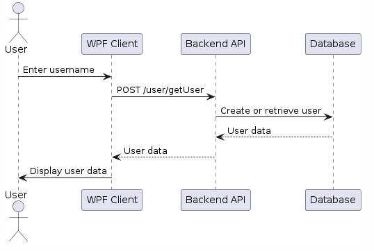
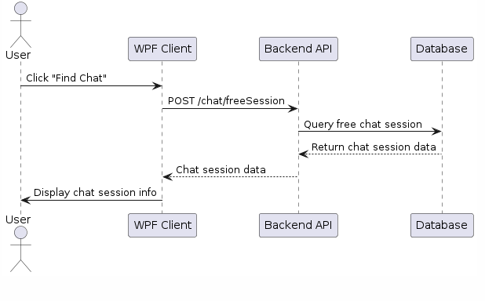
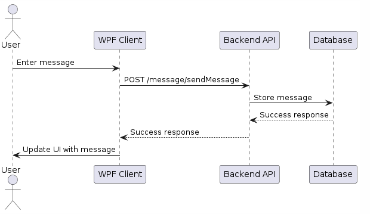

# AnonyChat

## Initial idea

Anonymous chat where people can enjoy each other's company for a limited amount of time.
Basically a meet-up app. You get to find people and possible friends.
Though be careful!

**Disclaimer**

I am not held responsible if anyone sends personal data over the chat.\
``Never Do That``

AnonyChat is a chat application that allows users to connect and chat anonymously. It is built using C# for the frontend and Java (Spring Boot) for the backend.

#Notice:

I initially wanted to use MongoDB as database, but later found some issues with the connection string.
Before looking into that further and trying to find problematic causes, I decided to switch to MySQL Workbench.
Trying SQL worked instantly and saved me a lot of time.

Initially the messaging was supposed to work via a Websocket that sent messages in real time to the users.
There was a version conflict that did not let me use Websocket and I came up with the idea that the users should just get the unique messages that have been stored in the meantime. This proccess is done using a delay of 2.5 seconds and works. Despite being a bit of a delay, it was a good implementation and change since I wouldn't have been done with the project otherwise.

## Table of Contents
- [Architecture](#architecture)
- [Communication Flow](#communication-flow)
  - [WPF Client](#wpf-client)
  - [Backend API](#backend-api)
  - [Database](#database)
- [API Endpoints](#api-endpoints)
  - [ChatController](#chatcontroller)
  - [MessageController](#messagecontroller)
  - [UserController](#usercontroller)
- [Database Schema](#database-schema)
- [Code Walkthrough](#code-walkthrough)
  - [MainWindow.xaml.cs](#mainwindowxamlcs)
  - [Window1.xaml.cs](#window1xamlcs)
- [UML Diagrams](#uml-diagrams)
  - [System Architecture Diagram](#system-architecture-diagram)
  - [Sequence Diagram for User Registration](#sequence-diagram-for-user-registration)
  - [Sequence Diagram for Chat Session Management](#sequence-diagram-for-chat-session-management)
  - [Sequence Diagram for Messaging](#sequence-diagram-for-messaging)

## Architecture

AnonyChat consists of three main components:
1. **WPF Client**: The frontend built using WPF (Windows Presentation Foundation).
2. **Backend API**: The backend server that handles requests and responses.
3. **Database**: Stores user data, chat sessions, and messages.

## Communication Flow

### WPF Client
The WPF client handles user interactions and communicates with the backend API to perform actions such as finding a chat session, sending messages, and leaving a chat.

Key methods:
- `FindChatButton()`: Initiates a request to find a free chat session.
- `LeaveChatButton()`: Sends a request to leave the current chat session.
- `SendButton()`: Sends a message to the current chat session.
- `UpdateChat()`: Periodically checks for new messages in the chat session.

### Backend API
The backend API provides endpoints for user registration, finding chat sessions, sending messages, and retrieving chat history. It interacts with the database to store and retrieve data.

Key controllers:
- `UserController`: Handles user-related operations.
- `ChatController`: Manages chat sessions.
- `MessageController`: Handles sending and retrieving messages.

### Database
The database stores user information, chat sessions, and messages. It ensures data persistence and consistency across the application.

## API Endpoints

### ChatController

- `POST /chat/freeSession`
  - **Description:** Fetches or creates a free chat session.
  - **Request Body:** `Integer id`
  - **Response:** `ChatSession`

- `GET /chat/less2`
  - **Description:** Fetches users with ID less than a given number.
  - **Request Params:** `Integer nr`
  - **Response:** `List<User>`

- `GET /chat/findByID`
  - **Description:** Fetches users by chat session ID.
  - **Request Params:** `Integer id`
  - **Response:** `List<User>`

### MessageController

- `POST /message/sendMessage`
  - **Description:** Sends a message.
  - **Request Body:** `Message`
  - **Response:** `Message`

- `POST /message/getMessages`
  - **Description:** Fetches messages for a chat session.
  - **Request Body:** `Integer chatSessionId`
  - **Response:** `List<MessageDTO>`

### UserController

- `POST /user/getUser`
  - **Description:** Registers a new user.
  - **Request Body:** `User`
  - **Response:** `User`

## Database Schema

- **Users**: Stores user details such as user ID and username.
- **ChatSessions**: Stores information about chat sessions.
- **Messages**: Stores chat messages with references to user and chat session IDs.

## Code Walkthrough

### MainWindow.xaml.cs
Handles the main functionality of the WPF client, including UI interactions and communication with the backend API.

- `MainWindow()`: Initializes the main window and displays the registration dialog.
- `FindChatButton()`: Starts the process of finding a chat session.
- `LeaveChatButton()`: Sends a request to leave the chat session.
- `SendButton()`: Sends a message to the chat session.
- `UpdateChat()`: Periodically checks for new messages and updates the chat window.

### Window1.xaml.cs
Handles user registration.

- `AddUser()`: Registers a new user by sending a request to the backend API.
- `usernameTextBox_TextChanged()`: Validates the username input.

## UML Diagrams

### 1. System Architecture Diagram

### 2. Sequence Diagram for User Registration

### 3. Sequence Diagram for Chat Session Management

### 4. Sequence Diagram for Messaging

