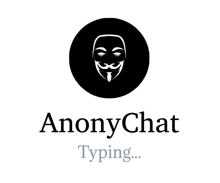

# AnonyChat

## Initial idea

Anonymous chat where people can enjoy eachother's company for a limited amount of time.
Basically a meet-up app. You get to find people and possible friends.
Though be careful!

**Disclaimer**

I am not held up for guilty if anyone sends personal data over the chat.\
``Never Do That``

## Setting up the server

Taking all needed Spring Boot to create the RESTful API endpoints for CRUD operations and health status checks.
That can easily be done here [springboot initializr](https://start.spring.io/).
Used Spring Boot : **Spring Data MongoDB**, **Spring Web**
